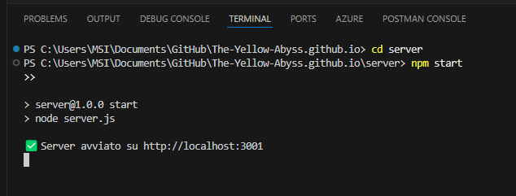
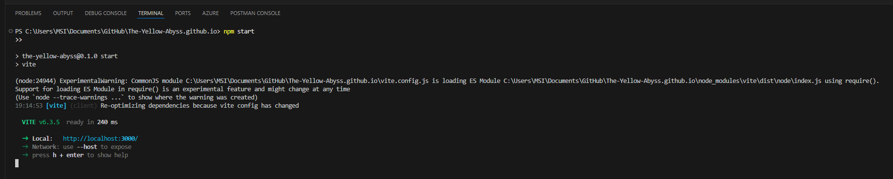
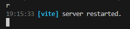

# The-Yellow-Abyss.github.io Manuale avvio del sito

## Comando per avviare React
1. Prima fai cd The-Yellow-Abyss.github.io
2. npm install (installi tutti i pacchetti)
3. npm install react-icons (per le icone di react)
4. npm run dev

## Comando per avviare il server Admin
1. Prima fai cd The-Yellow-Abyss.github.io
2. cd server
3. node server.js o npm start (per avviare il server)

5. Apri un nuovo terminale e fai npm start

6. usa react e segui i comandi di vite da terminale usa r per reload

## Cosegna progetto
1. [Documentazione PDF](The%20Yellow%20Abyss%20-%20PPM%20Documentazione_%20V_1.2.pdf)
2. Video panoramica del sito: https://youtu.be/C2zgA6FvGac
3. Video trailer del gioco: https://youtu.be/ovdiGDEuoYU
